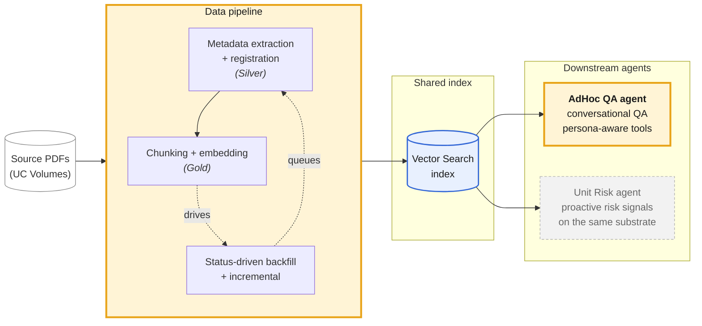

# Slide 4 — overview diagram (Mermaid draft v1)

Spec source: [`../arch-hive-slides-v2.md`](../arch-hive-slides-v2.md) → "Slide 4 — The complete flow, and what I designed".

Intent: 3 visual zones (data pipeline left, shared index middle, agents right) · 2 highlighted boxes for *my scope* (FSR pipeline + AdHoc QA agent) · 1 muted box for the separate-team work (Unit Risk reasoning agent) · arrows are agents → index (read-only), no back-arrows from agents into the pipeline.

---

## Diagram

---

## Scope callout (bottom strip, rendered as text on the slide — not in diagram)

> **My scope in this deck (slides 5–8):** the FSR pipeline (architecture + design tradeoffs) and the AdHoc QA agent (architecture + design choices).
>
> **Acknowledged but not deep-dived:** the Unit Risk reasoning agent — built by a separate team on the same substrate.

---

## Notes for the PPT pass

- **Highlight colors used here** are placeholders — adjust to deck palette in PPT. The *contrast ratio* between "mine" (warm gold) and "not mine" (muted grey + dashed border) is what carries the message; pick deck colors that preserve that contrast.
- **Small "my scope" label-tags** mentioned in the slide spec — add as PPT text labels overlaid on the FSR pipeline box and the AdHoc QA agent box (Mermaid can't do floating tags cleanly).
- **Three visual zones** are achieved via the `subgraph` blocks (PIPE / IDX / AGENTS). If the zones don't read clearly in the rendered output, add larger rectangle shapes behind them in PPT.
- **Read-only arrows** — all arrows from `VS` go *outward* to agents. No arrows from agents back to `VS` or `PIPE`. Matches the spec: "agents are read-only consumers — that's the architectural point."
- **No vendor / model names** in the diagram. "UC Volumes" + "Vector Search" are platform-architectural references only, allowed per the spec. LLM / embedding model not named here (those land on Slide 10).

## Open decisions for the visual pass

1. Should the `P3` status-driven backfill arrow back to `P1` be shown, or simplify to one-direction flow? Spec says "status-driven backfill + incremental from the same code path" — the loop matters. Currently shown as dotted feedback arrows. **Default: keep.**
2. Show source PDFs as a separate node vs. fold into the pipeline subgraph? Currently separate so the *input* is visible. **Default: keep separate.**
3. Unit Risk agent — muted grey + dashed border, no "separate team" tag inside the box (the scope callout below carries that). **Default: keep clean.**
