# Slide 5 — FSR pipeline architecture diagram (Mermaid draft v1)

Spec source: [`../arch-hive-slides-v2.md`](../arch-hive-slides-v2.md) → "Slide 5 — FSR pipeline — architecture".

Intent: Bronze → Silver → Gold medallion bands, with the **metadata registry as the spine** that doubles as the work queue. Process 1 writes the registry · Process 2 reads it for pending work and writes status back · same code path serves backfill and incremental.

---

## Diagram

```mermaid
flowchart TB
    %% ── BRONZE ───────────────────────────────────────────────────────────
    subgraph BRONZE["🥉 BRONZE — raw source volumes"]
        direction LR
        B1[("Source PDFs<br/>(2 UC volumes,<br/>top-level only)")]
        B2[("Reference data<br/>sources<br/><i>(for P1 enrichment)</i>")]
    end

    %% ── SILVER ───────────────────────────────────────────────────────────
    subgraph SILVER["🥈 SILVER — metadata extraction + registration (Process 1)"]
        direction LR
        P1A["1A · Discover<br/>new PDFs<br/><i>(left-anti vs registry)</i>"]
        P1B["1B · MERGE stub rows<br/><i>(status = pending)</i>"]
        P1C["1C · Extract +<br/>LLM normalize +<br/>reference enrich"]
        P1D["1D · Write metadata row<br/>per document<br/><i>(chunk_status = pending)</i>"]
        P1A --> P1B --> P1C --> P1D
    end

    %% ── REGISTRY (the spine) ─────────────────────────────────────────────
    REG[/"📒 REGISTRY (metadata table)<br/>one row per document<br/>metadata_status · chunk_status · retry counts<br/><b>= the work queue</b>"/]

    %% ── GOLD ─────────────────────────────────────────────────────────────
    subgraph GOLD["🥇 GOLD — AI-ready chunks + vector index (Process 2)"]
        direction LR
        P2A["2A · Select pending<br/>from registry"]
        P2B["2B · Load PDFs"]
        P2C["2C · Hierarchical<br/>semantic chunking"]
        P2D["2D · Materialize metadata<br/>onto chunk rows"]
        P2E["2E · Generate embeddings<br/><i>(parallel workers)</i>"]
        CHUNK[("Chunk table<br/>chunks + embeddings<br/>+ metadata columns")]
        VS[("Vector Search index<br/><i>DELTA_SYNC · TRIGGERED</i>")]
        P2A --> P2B --> P2C --> P2D --> P2E --> CHUNK --> VS
    end

    %% ── Flow ─────────────────────────────────────────────────────────────
    B1 --> P1A
    B2 -.->|"read for<br/>enrichment"| P1C
    P1D --> REG
    REG --> P2A
    P2E -.->|"write status:<br/>completed / failed"| REG

    %% ── Styling ──────────────────────────────────────────────────────────
    classDef bronze fill:#F4E4C1,stroke:#A0784A,stroke-width:2px,color:#1a1a1a;
    classDef silver fill:#E8E8E8,stroke:#8C8C8C,stroke-width:2px,color:#1a1a1a;
    classDef gold fill:#FFF4D6,stroke:#D4A017,stroke-width:2px,color:#1a1a1a;
    classDef registry fill:#FFE9CC,stroke:#E65C00,stroke-width:3px,color:#1a1a1a;
    classDef substrate fill:#E8F0FE,stroke:#3367D6,stroke-width:2px,color:#1a1a1a;

    class B1,B2 bronze;
    class P1A,P1B,P1C,P1D silver;
    class P2A,P2B,P2C,P2D,P2E,CHUNK gold;
    class REG registry;
    class VS substrate;

    linkStyle 8 stroke:#C0392B,stroke-width:2.5px,stroke-dasharray:5 4;
```

> The **red dashed arrow** (P2E → REG) is the closed loop that makes idempotence work — Process 2 writes status back to the registry so the same code path serves backfill and incremental.

---

## Notes for the PPT pass

- **Medallion bands as swim-lanes** — keep the Bronze/Silver/Gold color convention from the source drawio (`FSR/metadata-first-end-to-end-flow.drawio`). Reads from the back of the room.
- **Registry box visually centered between Silver and Gold** with arrows both ways — that two-way relationship is the heart of the design. The Mermaid layout puts REG between the SILVER and GOLD subgraphs which lands the visual correctly in most renderers; if it floats wrong in the PPT pass, anchor it manually as a callout shape.
- **Red dashed status-write-back arrow** — visually distinct from the forward-flow arrows. That's the loop that closes.
- **Discovery modes (TARGET / BACKLOG / DISCOVERY / FORCE_RESET)** — intentionally *not* shown on the diagram per the spec ("don't enumerate the four modes here"). Talk-track one-liner only if asked.
- **No real volume paths, no real table names, no LLM / embedding model names.** Generic role labels only.

## Open decisions for the visual pass

1. Should `P1A → P1B → P1C → P1D` show as discrete steps, or collapsed into one "Process 1" rectangle? Currently discrete (matches spec). **Default: keep discrete.**
2. Reference-data enrichment shown as a dotted-line input to P1C, not a full Bronze→Silver arrow — that keeps it as a "side read" not part of the main flow. **Default: keep dotted.**
3. Chunk table and Vector Search shown as separate nodes inside GOLD vs combined — keeping separate so the DELTA_SYNC relationship is visible. **Default: keep separate.**
