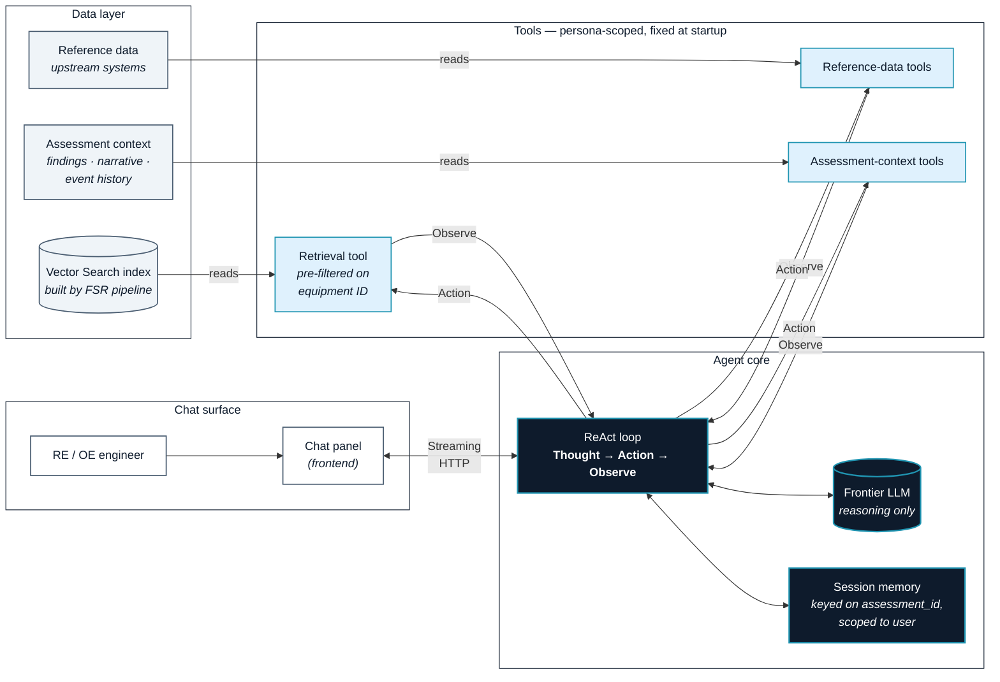

# Slide 7 — AdHoc QA agent architecture diagram (Mermaid draft v2)

Spec source: [`../arch-hive-slides-v2.md`](../arch-hive-slides-v2.md) → "Slide 7 — AdHoc QA agent — architecture".

Style reference: `unit-risk/8. AdHoc QA Agent.pdf` — left-to-right pipeline of grouped boxes (Data Layer → Backend Services → Q&A Agent → Chat Panel), labeled arrows, soft pastel fills.

Intent: Left-to-right flow — **user enters from the right** (Chat Panel), the agent core sits in the middle, tools sit between the agent and the data substrate on the left. The **boundary between the agent core and the tools is the grounding boundary** — tools return data, the LLM reasons over it. Retrieval lands on the *same* Vector Search index the FSR pipeline built (reinforces the shared-substrate claim from Slide 4).

---

## Diagram

> **The boundary between TOOLS and CORE is the grounding boundary.** Tools return data; the LLM reasons over the data. No tool result → no claim. That posture is what makes the agent trustable on day one.

---

## Notes for the PPT pass

- **Four grouped lanes left-to-right**: Data layer · Tools · Agent core · Chat surface. Mirrors the unit-risk reference layout.
- **Agent core is filled navy** (deck primary), so it reads as the centre of gravity. Tools sit in pale teal next to it. Data layer in neutral pale blue on the far left. Chat surface in white on the far right.
- **Retrieval arrow lands on the same VS index box visually used on Slide 4** — in the PPT pass, mirror the box shape/color from Slide 4 onto Slide 7 to reinforce "shared substrate."
- **No vendor / framework / LLM names on the diagram.** "ReAct loop", "frontier LLM", role-based tool names. Talk track can mention specifics if asked (Slide 4 / Stack slide names the stack).

## Open decisions for the visual pass

1. Persona indicator (RE vs OE) — currently implicit in the "RE / OE engineer" label, with tool list "persona-scoped, fixed at startup" called out on the TOOLS lane header. **Default: keep implicit; talk track makes the persona-aware point.**
2. Session memory shown as a separate node inside CORE so the privacy boundary reads as first-class. **Default: keep separate.**
3. Tools shown as 3 buckets; specific tool names *not* shown (would leak upstream system names). **Default: keep 3 buckets.**

